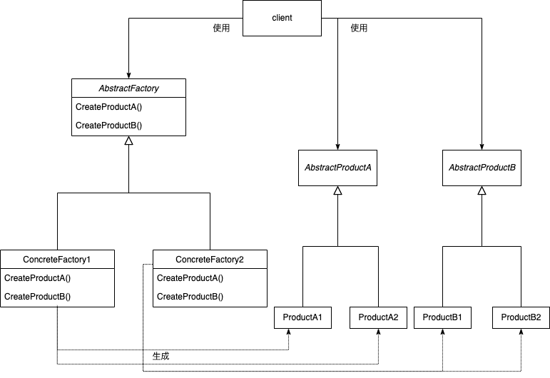

---

theme: "Solarized"
title: "Abstoract Factory"
slideNumber: true

---

## Abstract Factoryパターン

---

## 目的

互いに関連したり依存し合うオブジェクト群を、明確にせずに生成するためのインタフェースを提供する。

---

## こんな時に使えるかも

- システムを部品の生成、組み合わせ、表現の方法から独立にすべき場合

- 部品の集合が複数存在して、その中の一つを選んでシステムを構築する場合

- 関連する部品群を常に使用しなければならないように設計する場合

- 部品のクラスライブラリを提供する際に、インタフェースだけを公開して、実装は非公開にしたい場合

---

## 結果

1. 具象クラスを局所化する 
ユーザは抽象クラスの名前のみで操作し、実際の名前はConcreteFactoryクラスの中に収まっている。

2. 部品の集合を用意に変更できる 
ユーザは使うConcreteFactoryクラスの部分を変えるだけで、すべての部品を別の集合に変えられる。

3. 部品間の無矛盾性を上げられる 
別集合の部品同士をうっかり使ってしまうようなことは起きにくい。

4. 新しい部品の追加は困難である 
新しい部品のためには、新しい抽象メソッドと全種のサブクラスでの実装が必要になる。

---

## 実装のヒント

- ConcreteFactoryオブジェクトが1つしか必要ない場合は、Singletonパターンを併用することができる。

- 部品の集合が多数あるなら、ConcreteFactoryをPrototypeパターンで実装できることがある。

- AbstractFactoryがメソッドのシグネチャではなく、受け取る引数で生成すべき部品を判断できれば、新しい部品の追加も容易になる。一方で、部品が共通の抽象クラス由来になるという点に注意が必要だ。

