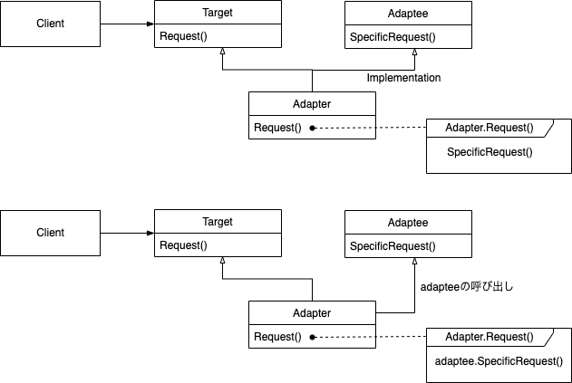

---

theme: "Solarized"
title: "Adapter"
slideNumber: true

---

## Adapter パターン

---

## 目的

あるクラスのインタフェースを、クライアントが求める他のインタフェースへ変換する。インタフェースに互換性がないクラス同士を組み合わせることができる。

---

## こんな時に使えるかも

- 既存のクラスを利用したいが、そのインタフェースが必要なインタフェースと一致していない場合

- 必ずしも互換性のあるインタフェースを持つとは限らないクラスとも協調していける、再利用可能なクラスを作成したい場合

---

## 結果

1. XXX

---

## 実装のヒント

- XXX