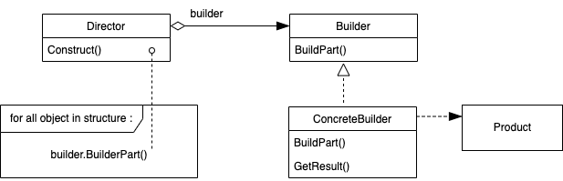

---

theme: "Solarized"
title: "Builder"
slideNumber: true

---

## Builder パターン

---

## 目的

複合オブジェクトについて、その作成過程を表現形式に依存しないものにすることにより、同じ作成過程で異なる表現形式のオブジェクトを生成できるようにする。

---

## こんな時に使えるかも

- 多くの構成要素からなるオブジェクトを生成するアルゴリズムを、構成要素自体やそれらがどのように組み合わされるのかということから独立にしておきたい場合

- オブジェクトの作成プロセスが、オブジェクトに対する多様な表現を認めるようにしておかなければならない場合

---

## 結果

1. Productオブジェクトの内部表現の変更が可能になる 
BuilderオブジェクトはProductオブジェクトを生成する抽象インタフェースを提供し、Productの内部構造や組み立て方を隠蔽している。

2. 生成や表現のためのコードを局所化する 
ConcreteBuilderクラスに特定のProductオブジェクトを生成するコードは集められ、Directorは構成が同じProductにはConcreteBuilderを再利用できる。

3. Productオブジェクトの作成過程をより細かくコントロールできるようになる 
DirectorがBuilderの内部でProductを段階的に組み立てられるため、ConcreteBuilderの中に詳細なProductの作り方を用意できる。

---

## 実装のヒント

- Directorが要求する可能性があるProductの生成過程を表すメソッドをすべて、抽象メソッドの形でBuilderは持っている。

- 様々なProductの内部表現がConcreteBuilderで作られるので、Productの共通親クラスを作るメリットは少ない。

- Builderクラスのメソッドは空実装や抽象メソッドにしておく。