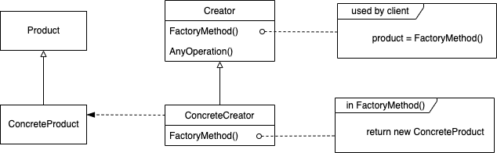

---

theme: "Solarized"
title: "Factory Method"
slideNumber: true

---

## Factory Methodパターン

---

## 目的

オブジェクトを生成するときのインタフェースだけを規定して、実際にどのクラスをインスタンス化するかはサブクラスが決めるようにする。Factory Methodパターンは、インスタンスかサブクラスに任せる。

---

## こんな時に使えるかも

- クラスが生成しなければならないオブジェクトのクラスを事前に知ることができない場合

- サブクラス化により、生成するオブジェクトを特定化する場合

- クラスが責任をいくつかのサブクラスの中の一つに移譲するときに、どのサブクラスに移譲するかを局所化したい場合

---

## 結果

1. サブクラスに手がかりを提供する 
Creatorクラスのfactory methodが、Creatorのサブクラスでのオーバーライドの内容のヒントになりうる。

2. パラレルなクラス階層をつなぐ 
Creatorクラスのfactory methodがProductクラスのインスタンスを返すようにしつつ、CreatorのサブクラスではProductのサブクラスを返すように実装すれば型が合う。

3. ユーザ定義のConcreteProductと協調させられる 
アプリケーションはProductのインタフェースしか扱わないので、ユーザ定義のProductのサブクラスでも使える。

4. サブクラスのために実装しなくてはならない 
ConcreteProductを生成するために、そのためのfactory methodを実装したCreatorのサブクラスを作らなくてはならない。

---

## 実装のヒント

- Creatorを抽象クラスとして、そのfactory methodの実装をサブクラスに全て任せる場合 
振る舞いを予測できないクラスをインスタンス化しなければならないジレンマを回避する。

- Creatorを具象クラスとして、そのfactory methodの実装を一応与えておく場合 
オブジェクトの生成は、サブクラスでその生成方法をオーバライドできるように、1つのメソッドにまとめておく。

- factory methodがパラメータを受け取って、生成するオブジェクトを識別するようにできる