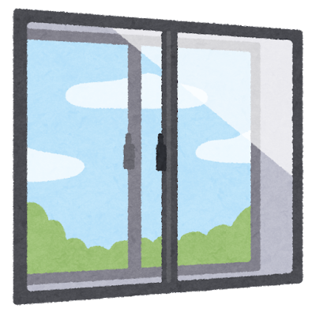
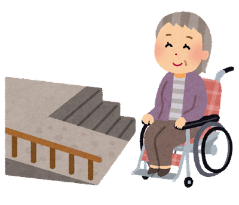

---

theme: "Solarized"
title: "GoF-導入"
slideNumber: true

---

#### オブジェクト指向における再利用のための
## デザインパターン

---

### なぜデザインパターンを使うのか
- アプリケーション設計で直面する問題を毎回、1から解くのは賢くない
- 小説家や脚本家がかつての名作（マクベスやハムレット）を参考にするように、エンジニアもかつてから成功している設計を利用するべきである

---

### デザインパターンとは
- 設計に関する問題への解法

- 何度でも解法を使えるように、パターンの**名前**、どんな**問題**に適用できるのか、どういった要素や関連を持つ**解法**なのか、その**結果**や影響をまとめておく必要がある。

寒い地域の窓なら二重窓、パリアフリーな段差にはスロープといった道具を用意する

--

## 注意
- 静的なオブジェクト指向言語に関するデザインパターンを取り扱うが、扱う言語の特性でパターンは変わってくることに注意が必要だ。

---

### オブジェクトパターンと似ているモノ

再利用に焦点を当てている点で似ている

- ツールキット
    - 有用かつ汎用的な機能を提供するように設計されたクラス集合
    - tcl/tkとかQtとかのGUI ツールキットが有名

- フレームワーク
    - 特定のソフトウェアを作るためにアーキテクチャを規定して、その中で再利用できるクラスの集合
    - JavaのSpring FrameworkやPythonのDjangoがWebアプリケーションのフレームワークに挙げられる
 
デザインパターンはより抽象的な概念であり、デザインパターンがツールキットやフレームワークに含まれることはある。