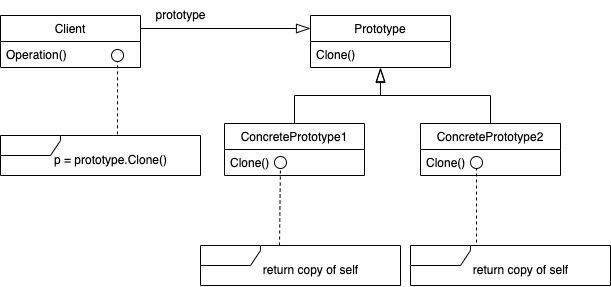

---

theme: "Solarized"
title: "Prototype"
slideNumber: true

---

## Prototype パターン

---

## 目的

生成すべきオブジェクトの種類を原型となるインスタンスを使って明確にし、それをコピーすることで新たなオブジェクトの生成を行う。

---

## こんな時に使えるかも

- インスタンス化されるクラスが、実行時に明らかになる場合

- 生成されるオブジェクトのクラス階層とパラレルな関係になるfactoryのクラスを作ることを避けたい場合

- クラスのインスタンスが、少数の状態の組み合わせの1つを取る場合

---

## 結果

1. Clientに対してインスタンス化する具象クラスを隠蔽できる

2. 生成するオブジェクトの追加/削除を実行時に行える 
Clientに新たな具象クラスを登録してシステムに取り込むことができる。

3. 値を変えることでオブジェクトの仕様を変更できる 
新たなクラス定義ではなくprototypeの変数の値を変えて新たな振る舞いを定義するという使い方ができる。システムに必要なクラスの数を減らせる。

4. インスタンスを複製するためのCloneメソッドを実装しなければならない 
オブジェクトが内部に複製をサポートしていないオブジェクトを含んでいたり、循環参照を持っていると、Cloneを実装することが困難になる。

---

## 実装のヒント

- Clientが直接prototypeの操作・登録を行うのではなく、prototypeを記憶・管理のためのprototypeマネージャを用意しておく。

- 深いコピーのためのCloneメソッドを実装する。

- prototypeから複製したオブジェクトの初期化の手段を、パラメータの受け取りや初期化用メソッドの実装などで準備しておく必要がある。