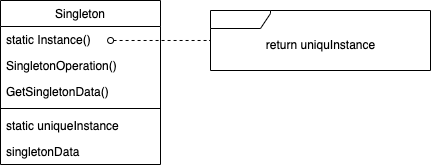

---

theme: "Solarized"
title: "Singleton"
slideNumber: true

---

## Singleton パターン

---

## 目的

あるクラスに対してインスタンスが1つしか存在しないことを保証し、それにアクセスするためのグローバルな方法を提供する。

---

## こんな時に使えるかも

- クラスに対してインスタンスが1つしか存在してはならず、また、暗いアンドがそのインスタンスを公開されたアクセスポイントを通してアクセスできるようにしなければならない場合

- 唯一のインスタンスがサブクラス化により拡張可能で、クライアントが拡張されたインスタンスをコードの修正なしに利用できるようにしたい場合

---

## 結果

1. インスタンスへのアクセスを制御する 
インスタンスがどのようにアクセスされるかを規定できる。

2. 名前空間を減らす 
Singletonのためにグローバル変数にを使う必要はない。

3. オペレーションや内部表現を詳細化できる 
Singletonクラスをサブクラス化して動作を細かく設定することもできる。

4. インスタンスの数を変える 
Singletonクラスが生成できるインスタンスの数を指定すれば、1つ以上のインスタンスを管理できる。

---

## 実装のヒント

- Singletonの有名な作り方はコンストラクタをクラス内部からしかアクセスできないようにして、最初だけインスタンスを初期化してメンバ変数に持っておき、次回以降はそのメンバ変数の中身を返すようにする方法である。

- Singletonのサブクラスを作った時に、クライアントはどのようにして使うSingletonサブクラスを選択できるだろうか。環境変数で決めてしまう方法、インスタンス生成のメソッドの実装をサブクラスに入れる方法がある。